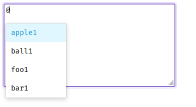

# vue-autocomplete-triggered

vue autocomplete with trigger symbols eg. @, #, etc

[](https://badge.fury.io/js/vue-autocomplete-triggered)



## Install

```bash
npm install vue-autocomplete-triggered
```

## Usage

```js
import AutoCompleteTextField from "vue-autocomplete-triggered";
import "vue-autocomplete-triggered/styles.css";

app.use(AutoCompleteTextField);
```
